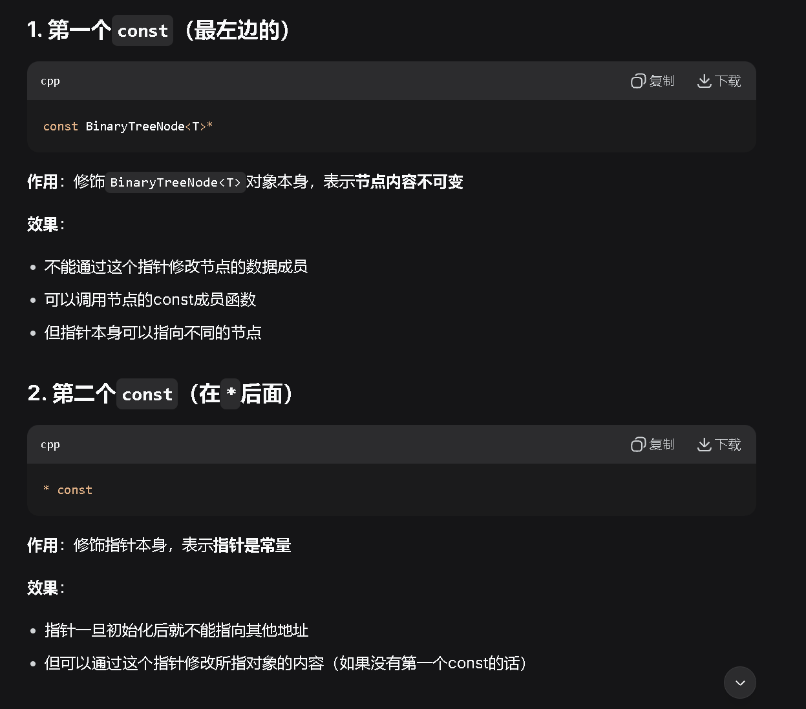

### 前加加 ++i
```c++
Data& Data::operator++(){//重载前自加
    helpIncremenet();//具体的自加操作，不是重点
    return *this;//返回调用对象的引用
}
```

### 后加加 i++
```c++
const Age operator++(int){ //后置++
    Age tmp = *this;
    ++(*this);  //利用前置++
    return tmp;
}   
```

### 函数指针
```cpp
#include <iostream>
#include <vector>

// 普通函数
int add(int a, int b) {
    return a + b;
}

int multiply(int a, int b) {
    return a * b;
}

// 函数参数是函数指针
void calculate(int a, int b, int (*operation)(int, int)) {
    int result = operation(a, b);
    std::cout << "结果: " << result << std::endl;
}

int main() {
    calculate(5, 3, add);       // 输出: 结果: 8
    calculate(5, 3, multiply);  // 输出: 结果: 15
    return 0;
}
```

### const 的作用

