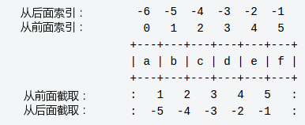
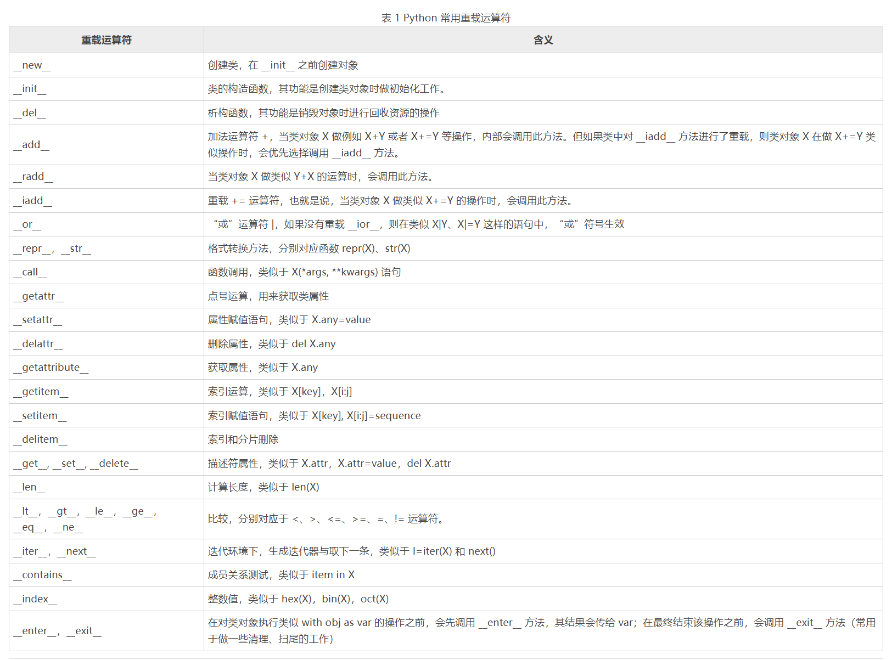

# Python基础

## python保留字
|   1    |    2   |   3   |   4   |   5   |   6   |
| ------ | ------ | ----- | ----- | ----- | ----- |
and|exec|not|assert|finally|or
break|for|pass|class|from|print
continue|global|raise|def|if|return
del|import|try|elif|in|while
else|is|with|except|lambda|yield

## 变量类型

### 数字（int float long complex）

* 多变量赋值  
   ```python
   a, b, c = 1, 2, "john"
   ```

* 删除对象的引用  
    ```python
    del var1[,var2[,var3[....,varN]]]
    ```

### 字符串
* 字符串
    ```python
    s = "a1a2···an"   # n>=0
    ```
* 索引  
    
* 示例
    ```python
    str = 'Hello World!'
    print(str)           # 输出完整字符串
    print(str[0])        # 输出字符串中的第一个字符
    print(str[2:5])      # 输出字符串中第三个至第六个之间的字符串
    print(str[2:])       # 输出从第三个字符开始的字符串
    print(str * 2)       # 输出字符串两次
    print(str + "TEST")  # 输出连接的字符串
    ```

### 列表
* 示例（与字符串类似）
    ```python
    list = [ 'runoob', 786 , 2.23, 'john', 70.2 ]
    tinylist = [123, 'john']
 
    print(list)               # 输出完整列表
    print(list[0])            # 输出列表的第一个元素
    print(list[1:3])          # 输出第二个至第三个元素 
    print(list[2:])           # 输出从第三个开始至列表末尾的所有元素
    print(tinylist * 2)       # 输出列表两次
    print(list + tinylist)    # 打印组合的列表
    ```

### 元组
* 元组**不能二次赋值**，相当于只读列表
* 示例
    ```python
    tuple = ( 'runoob', 786 , 2.23, 'john', 70.2 )
    tinytuple = (123, 'john')
    ```

### 字典
* 示例
    ```python
    dict = {}
    dict['one'] = "This is one"
    dict[2] = "This is two"
 
    tinydict = {'name': 'runoob','code':6734, 'dept': 'sales'}
 
    print(dict['one'])          # 输出键为'one' 的值
    print(dict[2])              # 输出键为 2 的值
    print(tinydict)             # 输出完整的字典
    print(tinydict.keys())      # 输出所有键
    print(tinydict.values())    # 输出所有值
    ```

## 运算符

### 算数运算符
运算符 | 描述
| --- | --- |
% | 取模
** | 幂运算
// | 取整除 - 返回商的整数部分（向下取整）

### 逻辑运算符
运算符 | 描述
| --- | --- |
and | 布尔"与" - 如果 x 为 False，x and y 返回 False，否则它返回 y 的计算值。
not | 	布尔"非" - 如果 x 为 True，返回 False 。如果 x 为 False，它返回 True。
or | 布尔"或" - 如果 x 是非 0，它返回 x 的计算值，否则它返回 y 的计算值。

### 成员运算符
运算符 | 描述
| --- | --- |
in | 如果在指定的序列中找到值返回 True，否则返回 False。
not in | 如果在指定的序列中没有找到值返回 True，否则返回 False。

### 身份运算符
运算符 | 描述
| --- | --- |
is | is 是判断两个标识符是不是引用自一个对象
is not | is not 是判断两个标识符是不是引用自不同对象

### 优先级
运算符 | 描述
| --- | --- |
**	|指数 (最高优先级)
~ + -	|按位翻转, 一元加号和减号 (最后两个的方法名为 +@ 和 -@)
\* / % //	|乘，除，取模和取整除
\+ -	 |加法减法
\>> <<	|右移，左移运算符
&	|位 'AND'
^ \|  	|位运算符
<= < > >=	|比较运算符
<> == !=	|等于运算符
= %= /= //= -= += *= **=	|赋值运算符
is is not	|身份运算符
in not in	|成员运算符
not and or	|逻辑运算符

## 语句
### 条件语句
    ```python
    if 判断条件1:
        执行语句1……
    elif 判断条件2:
        执行语句2……
    elif 判断条件3:
        执行语句3……
    else:
        执行语句4……
    ```

### 循环语句
    ```python
    fruits = ['banana', 'apple',  'mango']
    for index in range(len(fruits)):
        print ('当前水果 : %s' % fruits[index])
    ```
* 在 python 中，for … else 表示这样的意思，for 中的语句和普通的没有区别，else 中的语句会在循环正常执行完（即 for 不是通过 break 跳出而中断的）的情况下执行，while … else 也是一样。
* pass语句pass是空语句，是为了保持程序结构的完整性。

## 函数
* 语法
    ```python
    def functionname( parameters ):
        "函数_文档字符串"
        function_suite
        return [expression]
    ```

* 参数传递
在 python 中，strings, tuples, 和 numbers 是不可更改的对象，而 list,dict 等则是可以修改的对象。  
不可变类型：变量赋值 a=5 后再赋值 a=10，这里实际是新生成一个 int 值对象 10，再让 a 指向它，而 5 被丢弃，不是改变a的值，相当于新生成了a。  
可变类型：变量赋值 la=[1,2,3,4] 后再赋值 la[2]=5 则是将 list la 的第三个元素值更改，本身la没有动，只是其内部的一部分值被修改了。

* 关键字参数
    ```python
    def printinfo( name, age ):
        "打印任何传入的字符串"
        print "Name: ", name
        print "Age ", age
        return
    #调用printinfo函数
    printinfo( age=50, name="miki" )
    ```

* 不定长参数
    ```python
    def functionname([formal_args,] *var_args_tuple ):
        "函数_文档字符串"
        function_suite
        return [expression]
    ```

* 匿名函数
    ```python
    lambda [arg1 [,arg2,.....argn]]:expression
    ```

    ```python
    sum = lambda arg1, arg2: arg1 + arg2
    # 调用sum函数
    print "相加后的值为 : ", sum( 10, 20 )
    ```
    
* %
    ```python
    print("C语言中文网地址为：%s" % content)
    ```
## Python中的包
包是一个分层次的文件目录结构，它定义了一个由模块及子包，和子包下的子包等组成的 Python 的应用环境。

简单来说，包就是文件夹，但该文件夹下必须存在 `__init__.py` 文件, 该文件的内容可以为空。`__init__.py` 用于标识当前文件夹是一个包。


# Python进阶
## try异常处理
* 语法
    ```python
    try:
        可能产生异常的代码块
    except [ (Error1, Error2, ... ) [as e] ]:
        处理异常的代码块1
    except [ (Error3, Error4, ... ) [as e] ]:
        处理异常的代码块2
    except  [Exception]:
        处理其它异常
    ```

* 示例
    ```python
    try:
        a = int(input("输入被除数："))
        b = int(input("输入除数："))
        c = a / b
        print("您输入的两个数相除的结果是：", c )
    except (ValueError, ArithmeticError):
        print("程序发生了数字格式异常、算术异常之一")
    except :
        print("未知异常")
    print("程序继续运行")

    try:
        1/0
    except Exception as e:
        # 访问异常的错误编号和详细信息
        print(e.args)
        print(str(e))
        print(repr(e))
    ```
* 使用 else 包裹的代码，只有当 try 块没有捕获到任何异常时，才会得到执行；反之，如果 try 块捕获到异常，即便调用对应的 except 处理完异常，else 块中的代码也不会得到执行。
* finally 语句的功能是：无论 try 块是否发生异常，最终都要进入 finally 语句，并执行其中的代码块。

## raise 手动引发的异常
* 语法
    ```python
    raise [exceptionName [(reason)]]
    ```
* 事实上，raise 语句引发的异常通常用 try except（else finally）异常处理结构来捕获并进行处理
* 示例
    ```python
    try:
        a = input("输入一个数：")
        #判断用户输入的是否为数字
        if(not a.isdigit()):
            raise ValueError("a 必须是数字")
    except ValueError as e:
        print("引发异常：",repr(e))
    ```
* 使用`sys.exc_info()`获取异常
    ```python
    import sys
    try:
        x = int(input("请输入一个被除数："))
        print("30除以",x,"等于",30/x)
    except:
        print(sys.exc_info())
        print("其他异常...")
    ```

## assert 语句
* 断言语句，可以看做是功能 **缩小版的 if 语句**，它用于判断某个表达式的值，如果值为真，则程序可以继续往下执行；反之，Python 解释器会报 AssertionError 错误。
* 示例
    ```python
    mathmark = int(input())
    #断言数学考试分数是否位于正常范围内
    assert 0 <= mathmark <= 100
    #只有当 mathmark 位于 [0,100]范围内，程序才会继续执行
    print("数学考试分数为：",mathmark)
    ```

## 闭包函数
* 示例
    ```python
    #闭包函数，其中 exponent 称为自由变量
    def nth_power(exponent):
        def exponent_of(base):
            return base ** exponent
        return exponent_of # 返回值是 exponent_of 函数
    square = nth_power(2) # 计算一个数的平方
    cube = nth_power(3) # 计算一个数的立方
    print(square(2))  # 计算 2 的平方
    print(cube(2)) # 计算 2 的立方
    ```

## lambda表达式
* 语法
    ```python
    name = lambda [list] : 表达式
    ```
* 示例
    ```python
    add = lambda x,y:x+y
    print(add(3,4))
    ```

# Python面向对象
* 一切皆对象

## class类
* 语法
    ```python
    class 类名：
        多个（≥0）类属性...
        多个（≥0）类方法...
    ```

## `__init__()`类构造方法
* 示例
    ```python
    class CLanguage:
        def __init__(self,name,add):
            print(name,"的网址为:",add)
    #创建 add 对象，并传递参数给构造函数
    add = CLanguage("C语言中文网","http://c.biancheng.net")
    ```
## 类对象
* 实例化
    ```python
    类名(参数)
    ```
* 动态添加/删除变量
    ```python
    # 为clanguage对象增加一个money实例变量
    clanguage.money= 159.9
    print(clanguage.money)
    ```
    ```python
    #删除新添加的 money 实例变量
    del clanguage.money
    ```
* 动态添加方法
    ```python
    def info(self,content):
        print("C语言中文网地址为：%s" % content)
    # 导入MethodType
    from types import MethodType
    clanguage.info = MethodType(info, clanguage)
    # 第一个参数已经绑定了，无需传入
    clanguage.info("http://c.biancheng.net")
    ```

## self
在定义类的过程中，无论是显式创建类的构造方法，还是向类中添加实例方法，都要求将 `self` 参数作为方法的第一个参数
## 类方法
Python 类方法和实例方法相似，它最少也要包含一个参数，只不过类方法中通常将其命名为 cls，Python 会自动将类本身绑定给 cls 参数（注意，绑定的不是类对象）。也就是说，我们在调用类方法时，无需显式为 cls 参数传参。

和 self 一样，cls 参数的命名也不是规定的（可以随意命名），只是 Python 程序员约定俗称的习惯而已。

和实例方法最大的不同在于，类方法需要使用`＠classmethod`修饰符进行修饰，例如：  

    ```python
    class CLanguage:
        #类构造方法，也属于实例方法
        def __init__(self):
            self.name = "C语言中文网"
            self.add = "http://c.biancheng.net"
        #下面定义了一个类方法
        @classmethod
        def info(cls):
            print("正在调用类方法",cls)
    ```
## 静态方法
静态方法，其实就是我们学过的函数，和函数唯一的区别是，静态方法定义在类这个空间（类命名空间）中，而函数则定义在程序所在的空间（全局命名空间）中。  
静态方法需要使用`＠staticmethod`修饰。
## 封装
如果类中的变量和函数，其名称以双下划线“__”开头，则该变量（函数）为私有变量（私有函数），其属性等同于 private。
## 继承
    ```python
    class 类名(父类1, 父类2, ...)：
        #类定义部分
    ```
## `__slots__`
Python 提供了 __slots__ 属性，通过它可以避免用户频繁的给实例对象动态地添加属性或方法。  
**`__slots__` 只能限制为实例对象动态添加属性和方法，而无法限制动态地为类添加属性和方法。**  

    ```python
    class CLanguage:
        __slots__ = ('name','add','info')
    ```

## 动态创建类
    ```python
    #定义一个实例方法
    def say(self):
        print("我要学 Python！")
    #使用 type() 函数创建类
    CLanguage = type("CLanguage",(object,),dict(say = say, name = "C语言中文网"))
    #创建一个 CLanguage 实例对象
    clangs = CLanguage()
    #调用 say() 方法和 name 属性
    clangs.say()
    print(clangs.name)
    ```

## 枚举类
    ```python
    from enum import Enum
    class Color(Enum):
        # 为序列值指定value值
        red = 1
        green = 2
        blue = 3
    ```
## `__del__()`方法：销毁对象
    ```python
    class CLanguage:
        def __init__(self):
            print("调用 __init__() 方法构造对象")
        def __del__(self):
            print("调用__del__() 销毁对象，释放其空间")
    clangs = CLanguage()
    del clangs
    ```

## 重载
